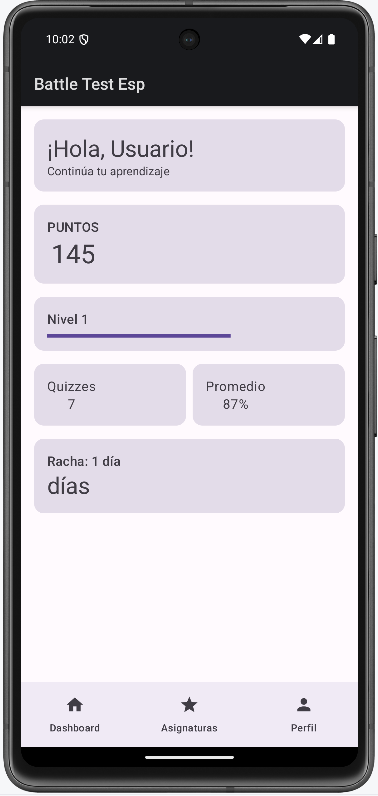
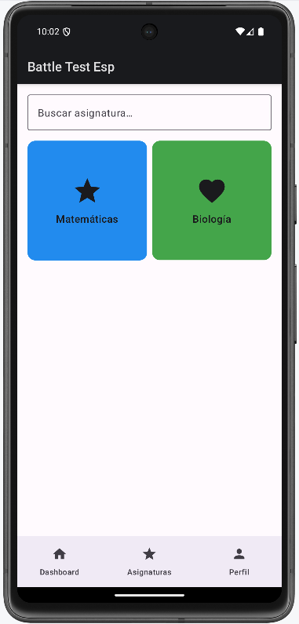
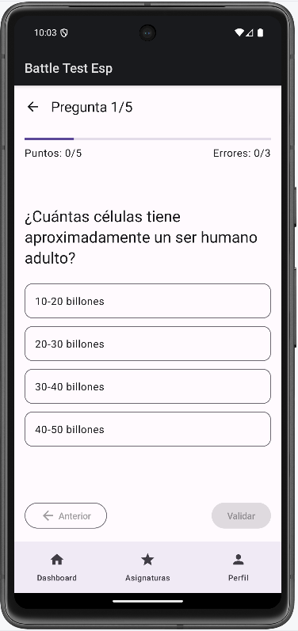
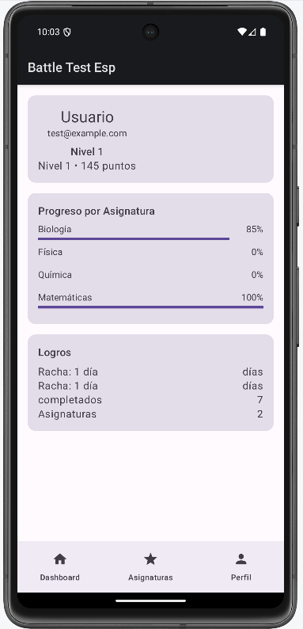

# Battle Test - Aplicación de Quizzes Educativos

[](https://android.com)
[](https://kotlinlang.org)
[](https://www.unam.mx)

Aplicación Android de cuestionarios educativos con sistema de gamificación, soporte multiidioma y arquitectura moderna MVVM.

## 📋 Descripción

Battle Test es una aplicación móvil diseñada para el aprendizaje interactivo mediante quizzes educativos en tres idiomas (español, inglés y francés). Implementa un sistema completo de gamificación con puntos, niveles, logros y rachas de aciertos, manteniendo persistencia local con Room Database y sincronización con backend REST.

## ✨ Características Principales

- **🌍 Multiidioma:** Soporte completo para español, inglés y francés sin strings hardcodeados
- **💾 Persistencia Local:** Base de datos Room con SQLite para progreso offline
- **🎮 Gamificación:** Sistema de puntos, niveles progresivos, logros desbloqueables y rachas diarias
- **🔄 Sincronización:** Integración con API REST alojada en Railway
- **📱 Offline-first:** Caché inteligente por idioma, funciona sin conexión después de primera carga
- **🎨 UI Moderna:** Jetpack Compose con Material Design 3

## 🏗️ Arquitectura

### MVVM + Repository Pattern

```
┌─────────────┐
│ UI (Compose)│
└──────┬──────┘
       │
┌──────▼──────┐
│  ViewModel  │
└──────┬──────┘
       │
┌──────▼──────┐
│ Repository  │
└──┬───────┬──┘
   │       │
┌──▼────┐ ┌▼────────┐
│ Room  │ │ Retrofit│
│   DB  │ │   API   │
└───────┘ └─────────┘
```

### Capas Implementadas

1. **Capa de Datos (`data/`)**
   - `database/`: Entities, DAOs, TypeConverters
   - `repository/`: Lógica de negocio y coordinación
   - `dto/`: Data Transfer Objects para API

2. **Capa de Dominio**
   - Models puros sin dependencias Android
   - Mappers bidireccionales (DTO ↔ Domain ↔ Entity)

3. **Capa de Presentación (`ui/`)**
   - Screens con Jetpack Compose
   - ViewModels con StateFlow/Flow
   - Navigation Compose type-safe

## 🛠️ Tecnologías Implementadas

### Requisitos Módulo 7 - UNAM

| Requisito | Implementación | Estado |
|-----------|----------------|--------|
| **Room Database** | StudentEntity, AchievementEntity, QuizResultEntity | ✅ |
| **Backend Web** | Retrofit + API Railway | ✅ |
| **ViewModel** | MVVM con StateFlow | ✅ |
| **Navegación** | Compose Navigation | ✅ |

### Stack Tecnológico

- **Lenguaje:** Kotlin 2.0.0
- **UI:** Jetpack Compose + Material 3
- **Base de datos:** Room Persistence Library
- **Networking:** Retrofit 2 + OkHttp
- **Inyección de dependencias:** Manual (Repository pattern)
- **Programación reactiva:** Kotlin Flow + Coroutines
- **Navegación:** Compose Navigation

## 📂 Estructura del Proyecto

```
app/src/main/java/com/igh/battletest/
├── data/
│   ├── database/
│   │   ├── entities/          # Room Entities
│   │   │   ├── StudentEntity.kt
│   │   │   ├── AchievementEntity.kt
│   │   │   └── QuizResultEntity.kt
│   │   ├── dao/               # Data Access Objects
│   │   │   ├── StudentDao.kt
│   │   │   └── QuizResultDao.kt
│   │   ├── mapper/            # Entity ↔ Domain mappers
│   │   └── Converters.kt      # TypeConverters (Date, List, Set)
│   ├── repository/
│   │   ├── QuizRepository.kt
│   │   └── StudentRepository.kt
│   ├── dto/                   # API DTOs
│   │   ├── QuizDto.kt
│   │   └── QuestionDto.kt
│   └── [Models].kt            # Domain models
├── viewmodel/
│   ├── SubjectsViewModel.kt
│   ├── DashboardViewModel.kt
│   └── ProfileViewModel.kt
├── ui/screens/
│   ├── SubjectsScreen.kt
│   ├── QuizScreen.kt
│   ├── ProfileScreen.kt
│   └── DashboardScreen.kt
├── manager/
│   ├── StudentManager.kt
│   └── AchievementManager.kt
└── MainActivity.kt
```

## 🔄 Flujo de Datos

### Carga de Quizzes

```kotlin
// 1. Usuario selecciona idioma
API Railway (español)
    ↓
Retrofit GET /api/quizzes/es
    ↓
Repository filtra por idioma local
    ↓
Caché SharedPreferences (por idioma)
    ↓
ViewModel StateFlow
    ↓
UI Compose renderiza
```

### Persistencia de Progreso

```kotlin
// 1. Usuario completa quiz
QuizScreen → StudentManager.completeQuiz()
    ↓
StudentRepository.updateProgress()
    ↓
Room Database UPDATE
    ↓
Flow emite cambios
    ↓
ProfileScreen se actualiza automáticamente
```

## 🚀 Instalación y Configuración

### Requisitos Previos

- Android Studio Koala (2024.1.1) o superior
- JDK 17
- Dispositivo/Emulador con API 24+ (Android 7.0+)
- Conexión a internet (solo primera carga)

### Pasos de Instalación

1. **Clonar el repositorio**
   ```bash
   git clone https://github.com/microIGH/Android_BattleTest_V2.git
   cd battle-test
   ```

2. **Abrir en Android Studio**
   - File → Open → Seleccionar carpeta del proyecto
   - Esperar sincronización de Gradle

3. **Ejecutar la aplicación**
   - Seleccionar dispositivo/emulador
   - Run → Run 'app' (Shift + F10)

### Configuración del Backend

El proyecto está configurado para usar la API de Railway:

```kotlin
// data/api/RetrofitClient.kt
private const val BASE_URL = "https://quiz-api-movil-production.up.railway.app/"
```

Para usar un backend diferente, modificar esta constante.

## 📸 Capturas de Pantalla

### Pantalla Principal


### Selección de Materias


### Quiz en Progreso


### Perfil de Usuario


> **Nota:** Colocar las imágenes en la carpeta `screenshots/` en la raíz del proyecto.

## 🎯 Características Destacadas

### 1. Sistema de Gamificación
```kotlin
// Cálculo automático de nivel basado en XP
val level = (xp / 100) + 1

// Logros desbloqueables
- "Primera Victoria" → Completar primer quiz
- "Estudioso" → 10 quizzes completados
- "Maestro" → Alcanzar nivel 10
```

### 2. Caché Inteligente Multiidioma
```kotlin
// Cada idioma tiene su propia caché
SharedPreferences:
- QUIZ_CACHE_es → Quizzes en español
- QUIZ_CACHE_en → Quizzes en inglés
- QUIZ_CACHE_fr → Quizzes en francés
```

### 3. Manejo de Errores Robusto
```kotlin
sealed class Result<T> {
    data class Success<T>(val data: T) : Result<T>()
    data class Error<T>(val exception: Exception) : Result<T>()
    data class Loading<T> : Result<T>()
}
```

### 4. TypeConverters Personalizados
```kotlin
// Room convierte tipos complejos automáticamente
@TypeConverter
fun fromStringList(value: List<String>): String
fun toStringList(value: String): List<String>
```

## 🧪 Testing

### Casos de Prueba Implementados

- ✅ Persistencia de estudiante después de quiz
- ✅ Cálculo correcto de nivel y XP
- ✅ Filtrado de quizzes por idioma
- ✅ Manejo de errores de red
- ✅ Caché offline funcional

### Ejecutar Tests (Pendiente)

```bash
./gradlew test           # Unit tests
./gradlew connectedCheck # Integration tests
```

## 🗺️ Roadmap

### Versión Actual (1.0.0)
- [x] Sistema de quizzes multiidioma
- [x] Persistencia Room
- [x] Integración con API
- [x] Gamificación básica

### Próximas Características
- [ ] Tests unitarios completos
- [ ] Pantalla de registro personalizada
- [ ] Sincronización bidireccional con backend
- [ ] Modo multijugador
- [ ] Análisis de rendimiento por materia
- [ ] Notificaciones push para rachas

## 🤝 Decisiones de Diseño

| Decisión | Alternativa | Justificación |
|----------|-------------|---------------|
| Room Database | SharedPreferences | Datos complejos con relaciones |
| Flow | LiveData | Mejor integración Compose + coroutines |
| Repository Pattern | Direct ViewModel-API | Única fuente de verdad, testeable |
| Caché por idioma | Re-descarga | Permite cambio de idioma offline |

## 📝 Configuración de Gradle

### Versiones Principales

```gradle
// build.gradle.kts (Project)
kotlin = "2.0.0"
compose = "1.5.4"
room = "2.6.1"
retrofit = "2.9.0"

// build.gradle.kts (App)
minSdk = 24
targetSdk = 34
compileSdk = 34
```

## 👨‍💻 Autor

**Israel García Hernández**
- Diplomado en Desarrollo de Aplicaciones para Dispositivos Móviles
- Universidad Nacional Autónoma de México (UNAM)
- Dirección General de Tecnologías de la Información y Comunicación (DGTIC)
- Módulo 7: Creación de Apps en Android

## 📄 Licencia

Este proyecto es material académico desarrollado como parte del Diplomado en Desarrollo de Aplicaciones para Dispositivos Móviles de la UNAM.

**Licencia Académica - UNAM DGTIC**

Prohibido el uso comercial. Permitido el uso educativo con atribución apropiada.

---

## 🔗 Enlaces Útiles

- [API Backend (Railway)](https://quiz-api-movil-production.up.railway.app/)
- [Documentación Android](https://developer.android.com)
- [Jetpack Compose](https://developer.android.com/jetpack/compose)
- [Room Persistence](https://developer.android.com/training/data-storage/room)

---

**Desarrollado con ❤️ usando Kotlin y Jetpack Compose**
